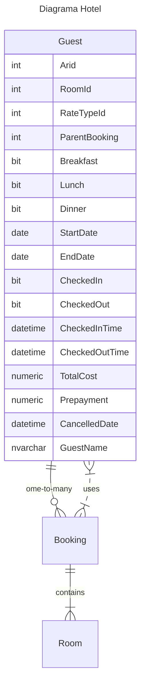

Hotel:

```mermaid
---
title: Diagrama Hotel
---
erDiagram
    Guest ||--o{ Booking : ome-to-many
    Guest {
        int Arid
        int RoomId
        int RateTypeId
        int ParentBooking
        bit Breakfast
        bit Lunch
        bit Dinner
        date StartDate
        date EndDate
        bit CheckedIn
        bit CheckedOut
        datetime CheckedInTime
        datetime CheckedOutTime
        numeric TotalCost
        numeric Prepayment
        datetime CancelledDate
        nvarchar GuestName
        
    }
    Booking ||--|{ Room : contains
    Guest }|..|{ Booking : uses
```
